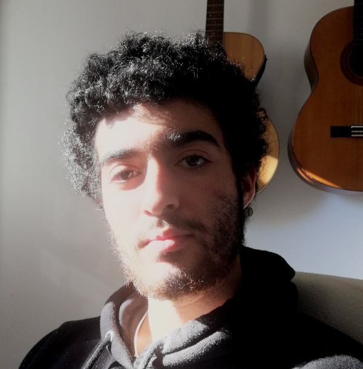

# Hello!

I am `João Camacho`, currently studying [Engineering Physics](https://tecnico.ulisboa.pt/en/education/courses/masters-programmes/engineering-physics/) at `Instituto Superior Técnico de Lisboa` ([IST](https://tecnico.ulisboa.pt/en/)).  

# Academic journey and interests

So far this is my academic progress:
- [X] Frist year student (Physics)
- [ ] Second year student (Physics)
- [ ] Third year student (Physics)
- [ ] Fourth year student (?)
- [ ] Fifth year student (?)

My interests include `physics`, `mathematics` and `programming`. A mix of the three is ideal for me!

# Other interests

I am comfortable with coding `python` and `C++`, and always willing to learn! 
Guitar player, boy-scout and artist in my free time.
